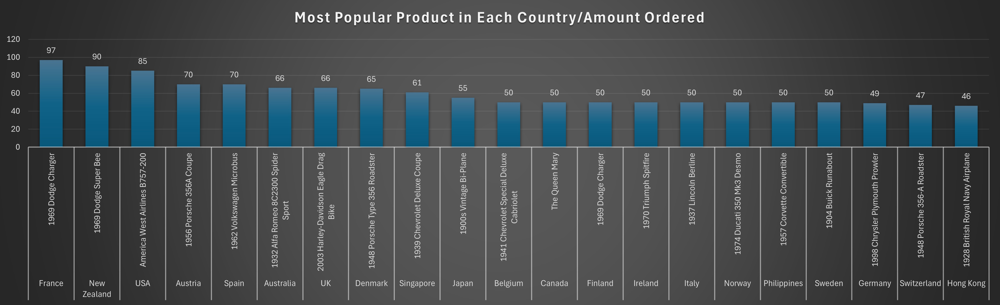
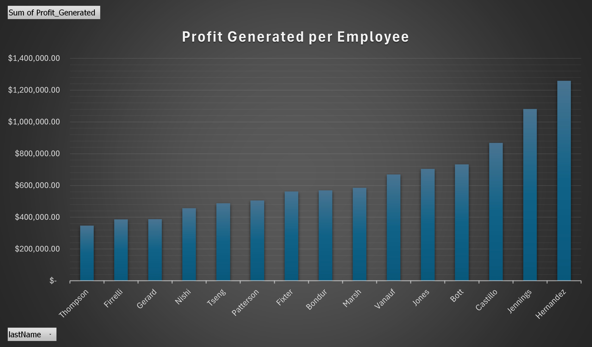

# Toy_Store
Analysis of Toy sales, types, customers, orders, and sales made. Data is seperated into several table detailing information such as orders, order details, customers, product descriptions, etc. I utilize join extensively to connect the different parts of my data and gain different perspectives of my data.

# Most popular product per country

# Most successful employee
